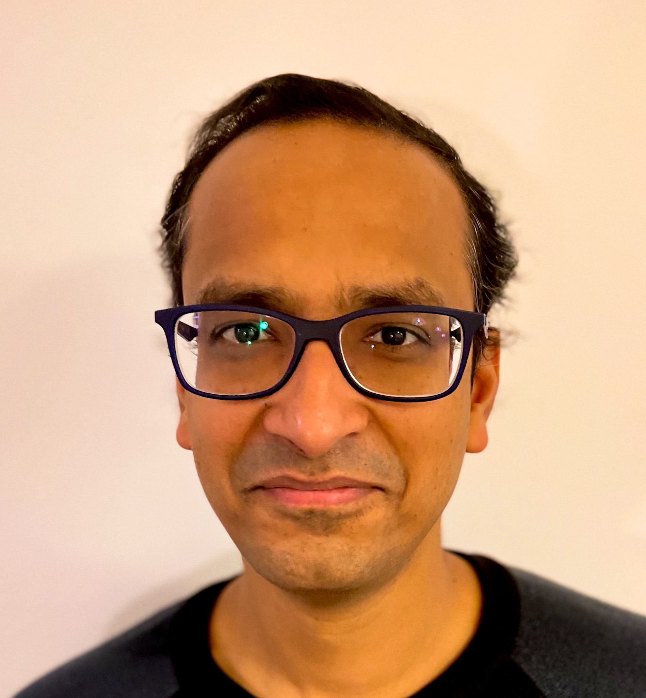

- 👋 Hi, I am Rohit Jhunjhunwala, Indian by birth currently living in Berlin Germany. I work on technologies to touch lives of billions of people across world and hopefully make a small positive impact 
- 👀 I’m interested in distributed systems, decentralization, large scale data processing, building organizations with people first approach. 
- 🌱 I’m currently learning all things decentralized and distributed at Affinidi, where we are building tools and platforms to give Users control of their data one step at a time
- 💞️ I’m looking to collaborate on decentralization, privacy aware data processing, high performing engineering culture and methodologies , team building
- 📫 I'm on twitter @rjhunjhunwla

<!---
rjhunjhunwla/rjhunjhunwla is a ✨ special ✨ repository because its `README.md` (this file) appears on your GitHub profile.
You can click the Preview link to take a look at your changes.
--->
